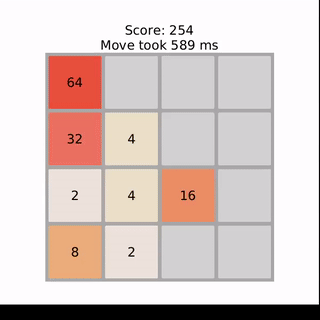

# TIRA

## Documentation
### [Instructions](https://github.com/jpasikainen/tira/blob/main/documentation/instructions.md)
### [Project Specification](https://github.com/jpasikainen/tira/blob/main/documentation/srs.md)
### [Testing](https://github.com/jpasikainen/tira/blob/main/documentation/testing.md)
### [Implementation](https://github.com/jpasikainen/tira/blob/main/documentation/implementation.md)

## Weekly reports

### [Week 1](https://github.com/jpasikainen/tira/blob/main/documentation/reports/w1.md)
### [Week 2](https://github.com/jpasikainen/tira/blob/main/documentation/reports/w2.md)
### [Week 3](https://github.com/jpasikainen/tira/blob/main/documentation/reports/w3.md)
### [Week 4](https://github.com/jpasikainen/tira/blob/main/documentation/reports/w4.md)
### [Week 5](https://github.com/jpasikainen/tira/blob/main/documentation/reports/w5.md)
### [Week 6](https://github.com/jpasikainen/tira/blob/main/documentation/reports/w6.md)