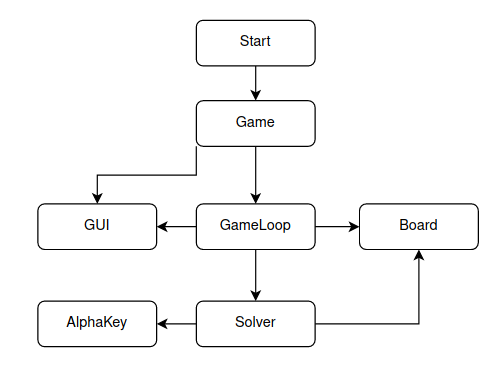

# Implementation
## Structure

## Time and Space Complexities
### Board
Highest complexity: moveTiles method\
Time: O(n²)\
Space: O(n²)

### Solver
Highest complexity: expectiMiniMax method\
Time: O(b^m n^m), where b=branching factor, m=max depth, n=number of free tiles * 2\
Space: O(b*m)\
Notes: When evaluating the heuristic score, the tile lookups are O(n^2). But since there are 16 tiles in total, the actual time complexity is O(16).

## Performance Analysis
### Results for 100 games
**Highest tile:** highest value the solver was able to achieve\
**256,512,1024,2048:** The percantage of the times the solver was able to achieve that value in a game\
**Mean score:** sum of scores divided by 100

| Depth        | 1   | 2   | 3    | 4    | 5    | 6    | 7     |
|--------------|-----|-----|------|------|------|------|-------|
| Highest Tile | 256 | 256 | 1024 | 1024 | 2048 | 2048 | 2048  |
| 256          | 18% | 29% | 100% | 96%  | 100% | 100% | 100%  |
| 512          | 0%  | 0%  | 94%  | 82%  | 99%  | 99%  | 100%  |
| 1024         | 0%  | 0%  | 25%  | 30%  | 71%  | 78%  | 90%   |
| 2048         | 0%  | 0%  | 0%   | 0%   | 10%  | 14%  | 48%   |
| Mean score   | 696 | 836 | 4096 | 4112 | 6779 | 7492 | 10477 |

## Current Shortcomings and Future Improvements
Change tiles to 64bit integer. Improve heuristics.

## Sources
https://en.wikipedia.org/wiki/Expectiminimax